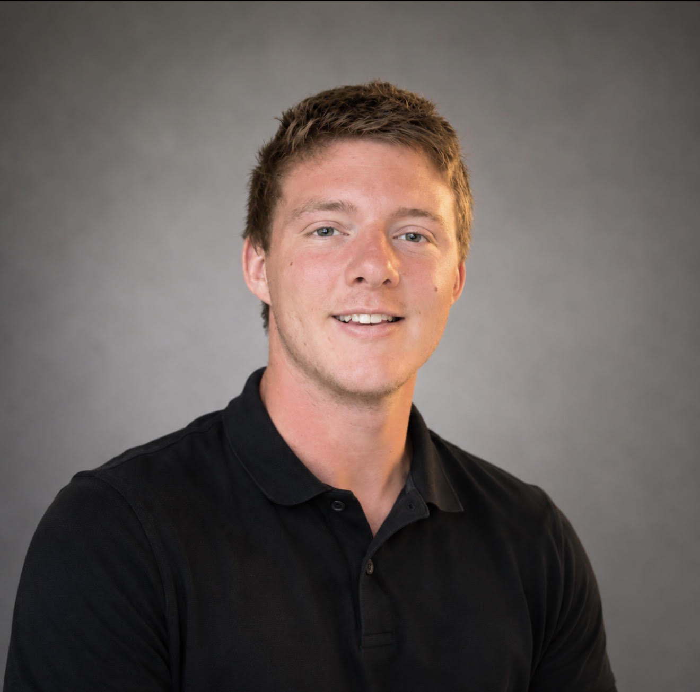

# About Me

## Kaleb Dedrick

My name is Kaleb Dedrick, I am a mechanical engineering student at UNC Charlotte. I chose mechanical engineering because I have always been interested in how machines and mechanical systems work. I enjoy learning how different parts work together and how engineers can improve a design to make it work better.

Currently, I am interning at Salas O'Brien as a mechanical engineering blueprint designer. I have worked on projects involving East Coast naval bases, hospitals, and fire stations. During my internship, I have gained experience using Revit and learning how engineering drawings and designs are developed for real projects.

As I continue through mechanical engineering, I want to improve my problem-solving skills and become better at using math and physics to solve real problems. I also want to continue improving my Revit skills and learn more about how engineers take a project from an early idea to a finished design.

Outside of engineering, I am very enthusiastic in weightlifting and working out. I currently bench 385 pounds and squat 465 pounds. I have stayed consistent with training for over four years, and it has taught me a lot about discipline and working toward long-term goals.

This portfolio will show my work and progress throughout the semester. My goal is to include my calculations, design choices, pictures, and final results in a way that another student, professor, or engineer can easily understand.
