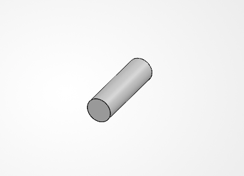

# MEGR 2156 Assignment 2 - Truss Stress

## 1. Truss Design

For this assignment, I designed a simple planar truss using A500 steel. I chose a load of:

**P = 25 kN**

The required dimensions were:

**a = 0.40 m**

**b = 0.30 m**

The truss has five joints labeled A, B, C, D, and E.

- A = pin support
- B = roller support
- C = upward load
- D = downward load
- E = center joint

The main dimensions are:

**BA = 1.20 m**

**CD = 0.40 m**

**b = 0.30 m**

---

# 2. Truss Calculations

## 2a(i) Member Lengths

The outside diagonal members are BC and DA. They both have a horizontal distance of 0.40 m and a vertical distance of 0.30 m.

Using the Pythagorean theorem:

**L = √[(0.40)² + (0.30)²]**

**L = 0.50 m**

So:

**L_BC = L_DA = 0.50 m**

The inside diagonal members are CE and ED. They have a horizontal distance of 0.20 m and a vertical distance of 0.30 m.

**L = √[(0.20)² + (0.30)²]**

**L = 0.3606 m**

So:

**L_CE = L_ED = 0.3606 m**

The top members are:

**L_BE = L_EA = 0.60 m**

The bottom member is:

**L_CD = 0.40 m**

The total member length is:

**L_total = 0.60 + 0.60 + 0.50 + 0.50 + 0.3606 + 0.3606 + 0.40**

**L_total = 3.3212 m**

---

## 2a(ii) Free Body Diagram and Reactions

I drew the full truss free body diagram by hand.

The support reactions are:

- A_x
- A_y
- B_y

Start with horizontal equilibrium:

**ΣF_x = 0**

There are no outside horizontal forces, so:

**A_x = 0**

Next, take moments about B:

**ΣM_B = 0**

**A_y(1.20) + P(0.40) - P(0.80) = 0**

**1.20A_y = 0.40P**

**A_y = P / 3**

With:

**P = 25 kN**

**A_y = 25 / 3**

**A_y = 8.33 kN**

Now use vertical equilibrium:

**ΣF_y = 0**

**B_y + A_y + P - P = 0**

**B_y = -A_y**

**B_y = -8.33 kN**

The negative answer means the reaction at B actually acts downward.

---

## 2a(iii) Symbolic Internal Forces

I used the method of joints to solve for the forces in each truss member.

### Joint B

For member BC:

**cosθ = 0.40 / 0.50 = 0.80**

**sinθ = 0.30 / 0.50 = 0.60**

Vertical equilibrium:

**-P / 3 - 0.60F_BC = 0**

**F_BC = -5P / 9**

The negative value means BC is in compression.

Horizontal equilibrium:

**F_BE + 0.80F_BC = 0**

**F_BE = 4P / 9**

BE is in tension.

### Joint A

Vertical equilibrium:

**P / 3 - 0.60F_DA = 0**

**F_DA = 5P / 9**

DA is in tension.

Horizontal equilibrium:

**-F_EA - 0.80F_DA = 0**

**F_EA = -4P / 9**

EA is in compression.

### Joint C

For member CE:

**sinθ = 0.30 / 0.3606**

The vertical force equation gives:

**F_CE = -(2√13 / 9)P**

CE is in compression.

The horizontal force equation gives:

**F_CD = 0**

CD is a zero-force member for this loading setup.

### Joint D

The vertical force equation gives:

**F_ED = (2√13 / 9)P**

ED is in tension.

---

## 2a(iv) Numerical Internal Forces

With:

**P = 25 kN**

the member forces are:

| Member | Force | Type |
|---|---:|---|
| BC | 13.89 kN | Compression |
| BE | 11.11 kN | Tension |
| CE | 20.03 kN | Compression |
| CD | 0 kN | Zero Force |
| ED | 20.03 kN | Tension |
| DA | 13.89 kN | Tension |
| EA | 11.11 kN | Compression |

The largest internal force is:

**F_max = 20.03 kN**

---

# 2b. Truss Member Sizing

## 2b(i) Knowns and Unknown

Known values:

**F_max = 20.03 kN**

**N = 3.5**

For A500 Grade B steel:

**S_y = 46 ksi**

The value I need to find is:

**A_min = ?**

---

## 2b(ii) Symbolic Area Equation

Normal stress is:

**σ = F / A**

The allowable stress is:

**σ_allow = S_y / N**

Set the member stress equal to the allowable stress:

**F / A = S_y / N**

Solve for area:

**A_min = (N × F) / S_y**

---

## 2b(iii) Numerical Area

The values used are:

**F = 20.03 kN**

**N = 3.5**

**S_y = 317 MPa**

Plugging these into the area equation:

**A_min = [(3.5)(20.03 × 10³)] / (317 × 10⁶)**

**A_min = 2.21 × 10⁻⁴ m²**

**A_min = 221 mm²**

Converted to square inches:

**A_min = 0.343 in²**

The CAD model uses:

**1 in × 1 in × 0.125 in square tube**

The cross-sectional area is approximately:

**A = 1² - (0.75)²**

**A = 0.4375 in²**

Since:

**0.4375 > 0.343**

the tubing is large enough for the required load and safety factor.

---

## 2b(iv) Estimated Truss Weight

The member cross-sectional area is:

**A = 0.4375 in²**

The total member length is:

**L = 3.3212 m**

Convert the length to inches:

**L = 130.76 in**

Volume:

**V = A × L**

**V = (0.4375)(130.76)**

**V = 57.21 in³**

Using a steel density of:

**ρ = 0.284 lb/in³**

The estimated weight is:

**W = ρ × V**

**W = (0.284)(57.21)**

**W_truss ≈ 16.25 lb**

---

# 3. Pin Design

The pins are made from hardened tool steel.

Given values:

**τ_y = 170 ksi**

**ρ = 0.278 lb/in³**

The required safety factor is:

**N = 4**

The pins are treated as single-shear connections.

---

## 3a(i) Knowns and Unknowns

Known values:

**V = 25 kN**

**N = 4**

**τ_y = 170 ksi**

Values to find:

**A_pin = ?**

**d_pin = ?**

---

## 3a(ii) Critical Pin

The largest applied joint load is:

**P = 25 kN**

The C or D connection can be used as the critical pin because both see the 25 kN applied load.

The shear force used for the pin calculation is:

**V = 25 kN**

The pin was modeled as a simple cylinder in SolidWorks using the diameter found from the shear calculations.

 

---

## 3a(iii) Symbolic Pin Area

Shear stress is:

**τ = V / A**

Allowable shear stress is:

**τ_allow = τ_y / N**

Set the pin shear stress equal to the allowable shear stress:

**V / A = τ_y / N**

Solve for the required pin area:

**A_pin = (N × V) / τ_y**

For a circular pin:

**A = πd² / 4**

The minimum diameter equation is:

**d_min = √[(4 × N × V) / (π × τ_y)]**

---

## 3a(iv) Numerical Pin Size

Convert 25 kN to pounds-force:

**25 kN ≈ 5620 lbf**

Minimum pin area:

**A_pin = (4 × 5620) / 170000**

**A_pin = 0.1322 in²**

Now solve for the diameter:

**d = √[(4 × 0.1322) / π]**

**d_min = 0.410 in**

I selected the next larger standard pin size:

**d = 7/16 in = 0.4375 in**

This is slightly larger than the calculated minimum diameter.

---

## 3a(v) Pin Weight

Each pin has:

**d = 0.4375 in**

**L = 1.50 in**

The volume of one pin is:

**V = (πd² / 4)L**

**V = [π(0.4375)² / 4](1.50)**

**V = 0.2255 in³**

The weight of one pin is:

**W = 0.2255 × 0.278**

**W = 0.0627 lb**

There are five pins:

**W_total = 5 × 0.0627**

**W_pins = 0.313 lb**

---

# 4. CAD Model

## Truss Without Pins

The final CAD model was made using the dimensions and member sizes found from the calculations.

The truss uses:

**1 in × 1 in × 0.125 in square tube**

All seven truss members use the same cross section.

I first modeled the truss without the pins so I could make sure the main geometry and joint locations matched the hand calculations.

The CAD model uses the same five joints and seven members that were used in the truss calculations.

 

---

## Finished Truss With Pins

After the truss body was finished, I added the pins to the five joint locations.

The pins use:

**7/16 in diameter**

and:

**1.50 in length**

All five pins use the same geometry.

The finished CAD model includes:

- Truss body
- Five pins
- Finished truss with pins
- Dimensioned drawing

 

---

## CAD and Hand Weight Comparison

The hand-calculated truss weight was:

**W_hand,truss = 16.25 lb**

The calculated pin weight was:

**W_pins = 0.313 lb**

The total hand-calculated weight is:

**W_hand,total = 16.25 + 0.313**

**W_hand,total = 16.56 lb**

The CAD model predicted:

**W_CAD,total = 16.16 lb**

Percent difference:

**Percent Difference = |16.56 - 16.16| / 16.56 × 100**

**Percent Difference ≈ 2.4%**

The CAD value came out slightly lower because the CAD model has material removed at the pin holes and joints. The hand calculation is a simpler estimate that treats the members as full-length pieces.

---

# 5. Engineering Lessons Learned

One thing I learned from this assignment was that it makes more sense to calculate the required member area before picking a tubing size. At first I considered using 2 in × 2 in × 0.25 in tubing, but after doing the calculations I found that it was much larger and heavier than necessary. The smaller tubing still meets the required safety factor while keeping the truss lighter.

I also learned how important the support reactions are when solving a truss. The pin at A and the roller at B do not have the same reactions, so the full free body diagram had to be solved before I could start finding the individual member forces.

The CAD portion showed me why hand calculations and CAD mass properties are not always exactly the same. The hand calculation uses a simple volume estimate, while the CAD model accounts for the actual geometry, joints, and pin holes. The two results were still very close.

I also learned that fully defining the SolidWorks sketch saves a lot of time. When my sketch was not fully constrained, changing one dimension caused the entire shape to move. Once I added the correct dimensions and fully defined the sketch, the rest of the model was much easier to finish.

---

# CAD Files

The following files are linked in my final PDF:

- Truss Body
- Pins
- Finished Truss
- Dimensioned Drawing
- Free Body Diagram

**Total project time:**  
This project took me around 2 hours to complete. The SolidWorks portion was the easiest part for me since I use SolidWorks regularly at work.
