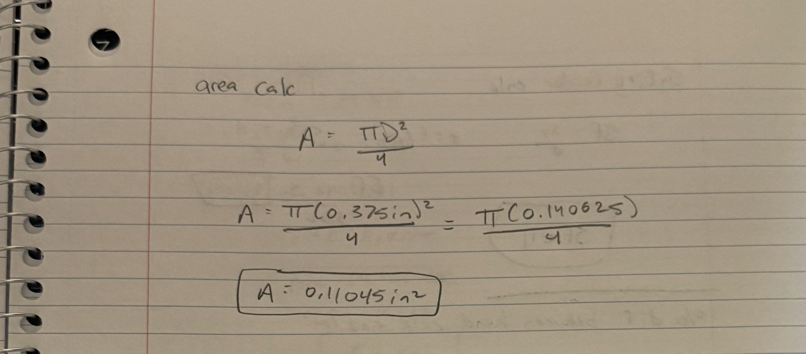
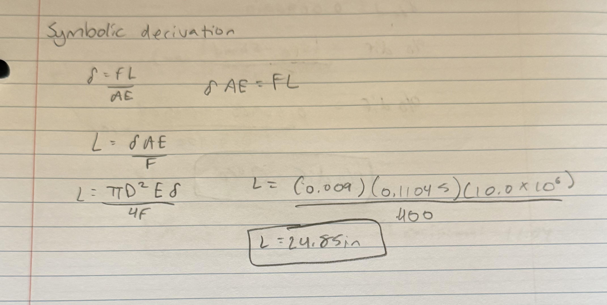
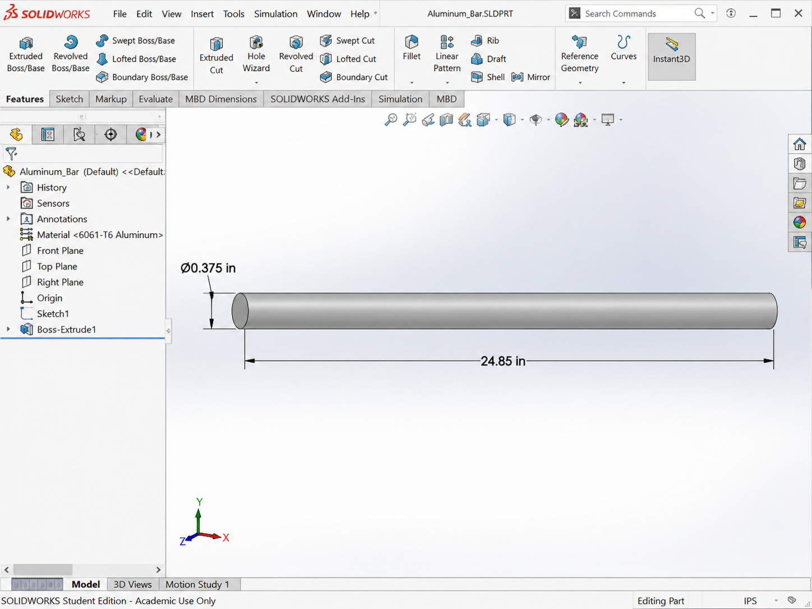
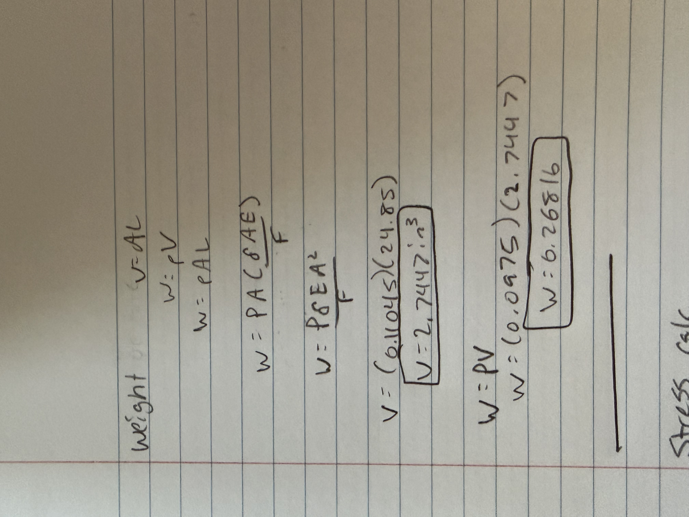
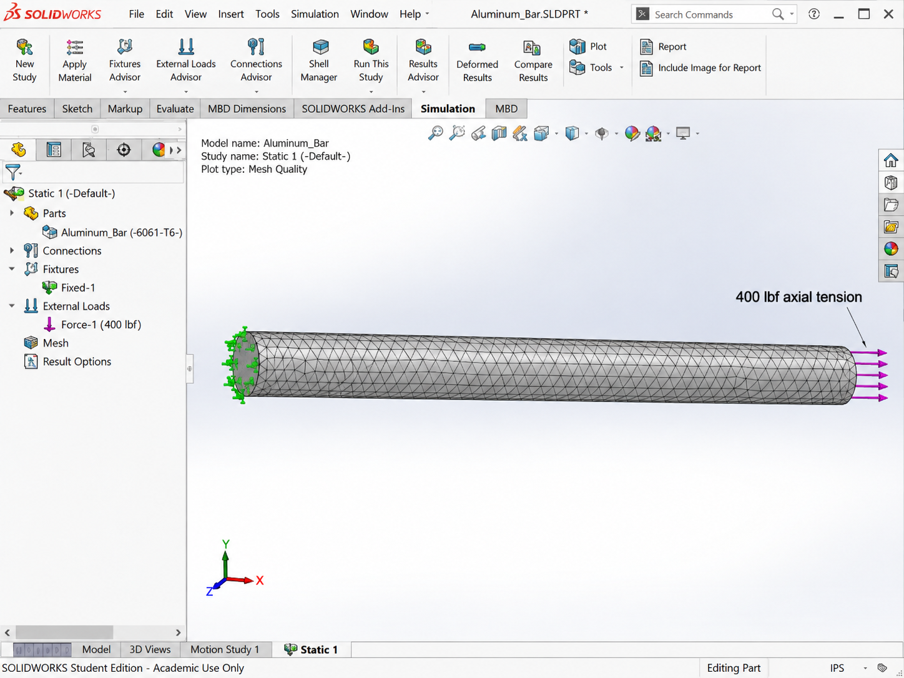
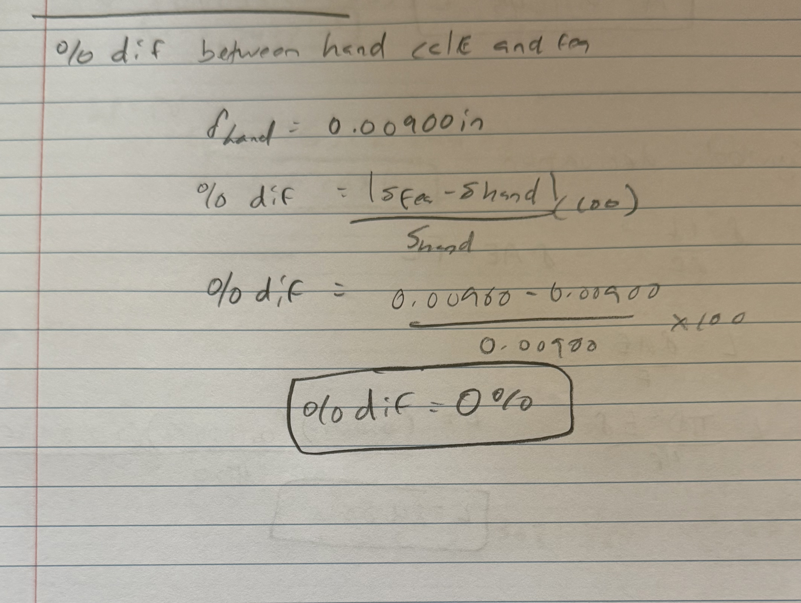
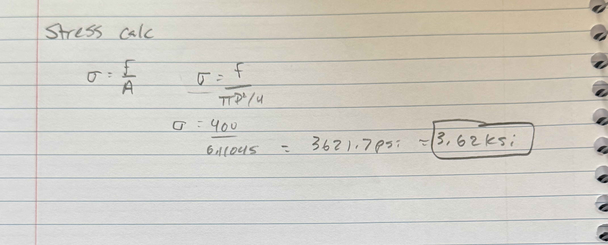
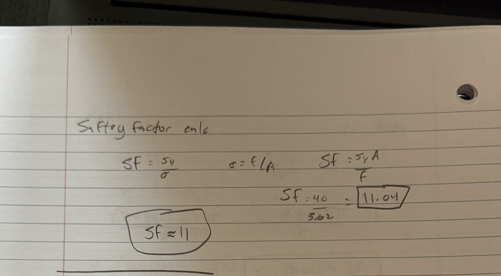
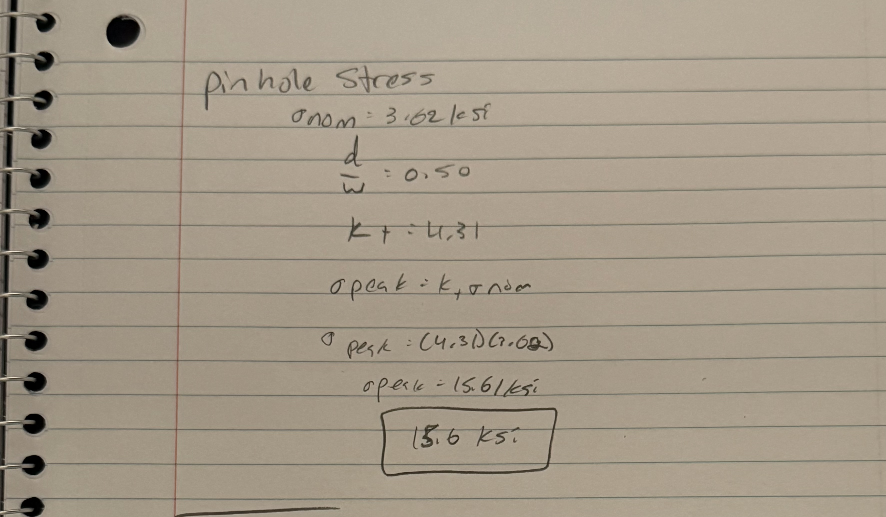
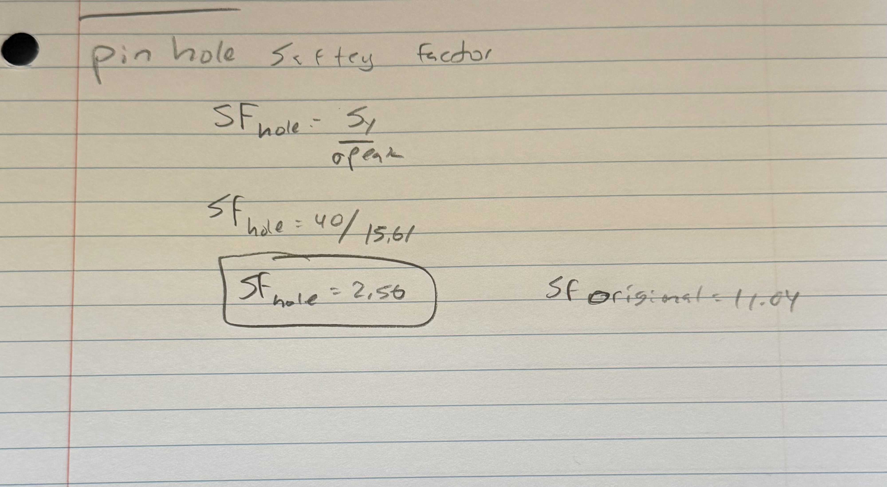

# MEGR 2156 Assignment: Parametric and FEA

## Introduction

For this assignment, I designed an aluminum bar using parametric modeling and finite element analysis. The goal was to design the bar so that the maximum axial deflection stayed at or below 0.009 in while using a load between 300 and 500 lbf.

I used a parametric equation to control the length of the bar. This means that if the load, diameter, Young's modulus, or maximum deflection changes, the length of the bar will automatically change.

The values used for this design were:

- Load: **F = 400 lbf**
- Maximum deflection: **δ = 0.009 in**
- Young's modulus: **E = 10.0 × 10⁶ psi**
- Bar diameter: **D = 0.375 in**
- Aluminum strength: **Sy = 40 ksi**
- Aluminum density: **ρ = 0.0975 lb/in³**

---

# 1. Parametric Bar Design

## Cross-Sectional Area

The bar uses a circular cross section.

The symbolic area equation is:

<strong>A = πD² / 4</strong>

Using a diameter of 0.375 in:

<strong>A = π(0.375)² / 4</strong>

<strong>A = 0.11045 in²</strong>

  

  <em>Figure 1. Hand calculation for the cross-sectional area.</em>

---

## Symbolic Derivation for Bar Length

The direct tension elongation equation is:

<strong>δ = FL / AE</strong>

The assignment asks for the length of the bar, so I solved the equation symbolically for **L**.

Starting with:

<strong>δ = FL / AE</strong>

Multiply both sides by **AE**:

<strong>δAE = FL</strong>

Divide both sides by **F**:

<strong>L = δAE / F</strong>

For a circular cross section:

<strong>A = πD² / 4</strong>

Substituting the area equation into the length equation gives:

<strong>L = πD²Eδ / 4F</strong>

This is the final symbolic equation used to control the bar length.

### Numerical Length Calculation

Using the selected values:

<strong>L = (0.009)(0.11045)(10.0 × 10⁶) / 400</strong>

<strong>L = 24.85 in</strong>

  

  <em>Figure 2. Symbolic derivation and numerical calculation for bar length.</em>

The final bar dimensions were:

- Diameter = **0.375 in**
- Length = **24.85 in**

---

# 2. Parametric CAD Model

The bar was designed parametrically instead of manually entering the final length.

The main variables used in the Equation Manager were:

- Load
- Young's modulus
- Maximum deflection
- Diameter
- Area
- Length
- Density
- Weight

The main equation controlling the length was:

<strong>L = δAE / F</strong>

The circular cross-sectional area was controlled using:

<strong>A = πD² / 4</strong>

Because the dimensions are linked to variables, changing the load, material stiffness, diameter, or allowable deflection changes the calculated bar length.

  

  <em>Figure 3. Equation Manager showing the parametric variables and equations.</em>

The finished bar had a diameter of 0.375 in and a length of approximately 24.85 in.

  

  <em>Figure 4. Finished parametric aluminum bar.</em>

---

# 3. Bar Weight

The volume of the bar is:

<strong>V = AL</strong>

The weight is:

<strong>W = ρV</strong>

Substituting the volume equation gives:

<strong>W = ρAL</strong>

The symbolic length equation is:

<strong>L = δAE / F</strong>

Substituting this into the weight equation gives:

<strong>W = ρA(δAE / F)</strong>

Therefore:

<strong>W = ρδEA² / F</strong>

### Numerical Volume Calculation

<strong>V = (0.11045)(24.85)</strong>

<strong>V = 2.7447 in³</strong>

### Numerical Weight Calculation

<strong>W = (0.0975)(2.7447)</strong>

<strong>W = 0.268 lb</strong>

  

  <em>Figure 5. Hand calculation for bar volume and weight.</em>

---

# 4. Finite Element Analysis Setup

A static finite element analysis was used to evaluate the displacement and von Mises stress in the bar.

The same loading conditions from the hand calculations were used for the FEA setup.

The left end of the bar was fixed and the right end was subjected to an axial tensile load of:

<strong>F = 400 lbf</strong>

  

  <em>Figure 6. FEA boundary conditions and 400 lbf axial tensile load.</em>

---

## FEA Mesh

A finite element mesh was generated over the full bar.

Because the bar has a simple shape and a constant circular cross section, the mesh is able to show the axial behavior across the bar.

  

  <em>Figure 7. Finite element mesh on the aluminum bar.</em>

---

# 5. Deflection Results

The hand-calculated maximum deflection was:

<strong>δhand = 0.00900 in</strong>

The FEA displacement result was:

<strong>δFEA = 0.00900 in</strong>

The displacement increased from approximately zero at the fixed end to its maximum value at the loaded end.

  

  <em>Figure 8. FEA displacement and deflection map.</em>

---

## Percent Difference Between Hand Calculation and FEA

The percent difference equation is:

<strong>Percent Difference = |δFEA − δhand| / δhand × 100</strong>

Substituting the results:

<strong>Percent Difference = |0.00900 − 0.00900| / 0.00900 × 100</strong>

<strong>Percent Difference = 0 / 0.00900 × 100</strong>

<strong>Percent Difference = 0.00%</strong>

  

  <em>Figure 9. Hand calculation for percent difference between analytical and FEA deflection.</em>

The two values are essentially the same because the geometry and loading are very simple. The bar has a constant cross section and is loaded directly along its axis.

Small differences can normally happen because of mesh size, numerical rounding, material properties, or boundary conditions.

For this simple bar, I would trust the hand calculation because the equation directly represents this loading case. For a more complicated geometry, FEA would become more useful because it can show stress concentrations.

---

# 6. Stress Calculation

The axial stress equation is:

<strong>σ = F / A</strong>

For a circular cross section:

<strong>A = πD² / 4</strong>

Therefore, the stress equation can also be written as:

<strong>σ = 4F / πD²</strong>

### Numerical Stress Calculation

<strong>σ = 400 / 0.11045</strong>

<strong>σ = 3621.7 psi</strong>

Converting to ksi:

<strong>σ = 3.62 ksi</strong>

  

  <em>Figure 10. Hand calculation for axial stress.</em>

The FEA von Mises stress was approximately:

<strong>σFEA = 3.62 ksi</strong>

  

  <em>Figure 11. FEA von Mises stress map.</em>

The assigned aluminum strength is:

<strong>Sy = 40 ksi</strong>

Since:

<strong>3.62 ksi &lt; 40 ksi</strong>

the bar is below the assigned strength limit.

---

# 7. Safety Factor

The safety factor equation is:

<strong>SF = Sy / σ</strong>

Since:

<strong>σ = F / A</strong>

the safety factor can also be written symbolically as:

<strong>SF = SyA / F</strong>

Using the calculated stress:

<strong>SF = 40 / 3.62</strong>

<strong>SF = 11.04</strong>

  

  <em>Figure 12. Hand calculation for the original safety factor.</em>

The original bar has a safety factor of approximately:

<strong>SF ≈ 11</strong>

This means the calculated axial stress is much lower than the assigned material strength.

---

# 8. Pin Hole Stress Concentration

The assignment also asked what would happen if a fairly large pin hole was added to the bar.

A hole creates a stress concentration because the load has to travel around the missing material.

For this estimate, the assumed hole-to-width ratio was:

<strong>d / W = 0.50</strong>

The estimated stress concentration factor was:

<strong>Kt = 4.31</strong>

The nominal stress away from the hole is:

<strong>σnom = 3.62 ksi</strong>

The peak stress is calculated using:

<strong>σpeak = Ktσnom</strong>

Substituting the values:

<strong>σpeak = (4.31)(3.62)</strong>

<strong>σpeak = 15.6 ksi</strong>

  

  <em>Figure 13. Hand calculation for estimated peak stress near the pin hole.</em>

The estimated pin hole increases the local stress from about 3.62 ksi to about 15.6 ksi.

---

# 9. Pin Hole Safety Factor

The safety factor with the pin hole is:

<strong>SFhole = Sy / σpeak</strong>

Substituting the values:

<strong>SFhole = 40 / 15.6</strong>

<strong>SFhole = 2.56</strong>

  

  <em>Figure 14. Hand calculation for the pin-hole safety factor.</em>

The original safety factor was:

<strong>SForiginal = 11.04</strong>

The safety factor with the hole was:

<strong>SFhole = 2.56</strong>

This shows that adding a hole can greatly increase the local stress even when the applied load stays the same.

---

# 10. Design Reflection

The hand calculation and FEA result gave essentially the same displacement.

The main reason is that this problem uses a straight bar with a constant cross section and a simple axial tensile load.

The analytical equation is:

<strong>δ = FL / AE</strong>

This equation works well for this type of geometry.

The original bar:

- Has a constant circular cross section
- Has a simple axial tensile load
- Does not have holes or notches
- Uses linear elastic material behavior

For the basic bar, I would trust the hand calculation because it is a direct solution for this exact loading case.

For parts with holes, fillets, notches, or more complicated geometry, FEA becomes more useful because those features can create local stress concentrations.

---

# 11. Lessons Learned

This assignment helped me understand the difference between manually entering a CAD dimension and actually making a model parametric.

One of the main things I learned was that the final length should not just be calculated and manually typed into CAD.

Instead, the equation:

<strong>L = δAE / F</strong>

controls the length dimension.

This allows the geometry to change automatically if the design parameters change.

I also learned how hand calculations and FEA can be used together. For a simple axial bar, the two methods should give very similar results.

The pin-hole calculation also showed how important stress concentrations can be.

The original safety factor was:

<strong>SForiginal = 11.04</strong>

The safety factor with the pin hole was:

<strong>SFhole = 2.56</strong>

This was a large decrease even though the applied load did not change.

**Actual time spent: INSERT ACTUAL TIME HERE**

---

# 12. CAD Files

The CAD package for the bar can be downloaded below.

[Download CAD Package](./MEGR2156_Parametric_Aluminum_Bar_CAD_Package.zip)

The current bar geometry is:

- Diameter = **0.375 in**
- Length = **24.85 in**
- Load = **400 lbf**
- Young's modulus = **10.0 × 10⁶ psi**
- Maximum deflection = **0.009 in**

---

# Final Results

| Item | Result |
|---|---:|
| Applied Load | 400 lbf |
| Diameter | 0.375 in |
| Cross-Sectional Area | 0.11045 in² |
| Bar Length | 24.85 in |
| Bar Weight | 0.268 lb |
| Hand Deflection | 0.00900 in |
| FEA Deflection | 0.00900 in |
| Percent Difference | 0.00% |
| Nominal Axial Stress | 3.62 ksi |
| FEA von Mises Stress | 3.62 ksi |
| Original Safety Factor | 11.04 |
| Pin Hole Stress Concentration Factor | 4.31 |
| Estimated Pin Hole Peak Stress | 15.6 ksi |
| Pin Hole Safety Factor | 2.56 |
