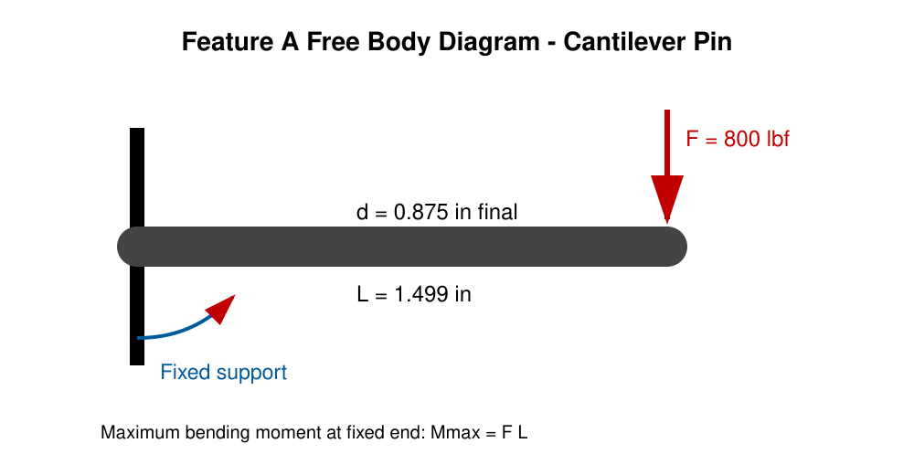
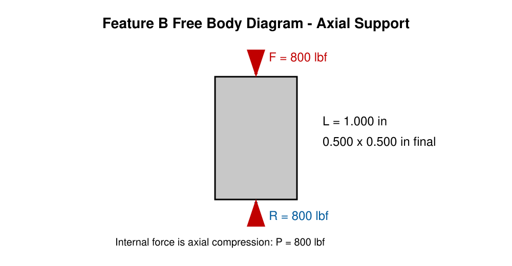
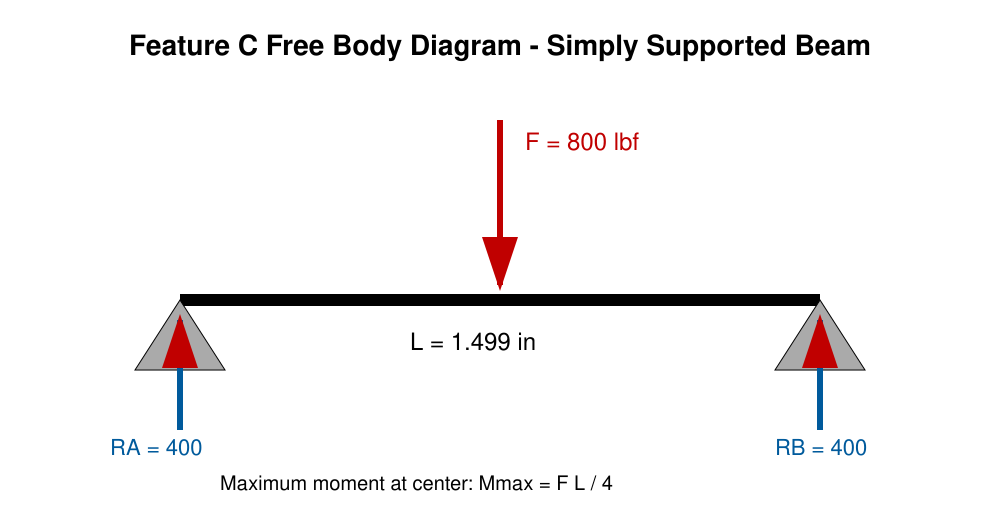
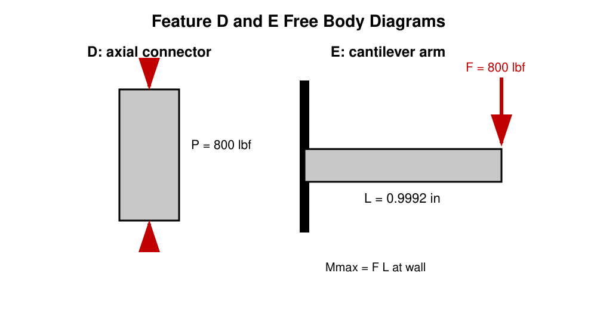
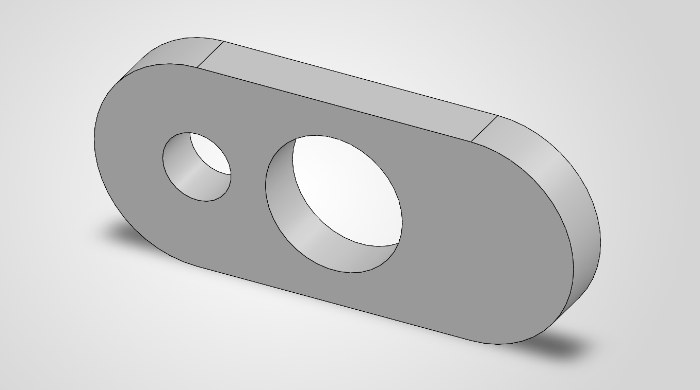

# MEGR 2157 Design for Strength and Stiffness I

**Student:** Kaleb Dedrick

**Course:** MEGR 2157

**Design Load:** 800 lbf

**Material:** 6061-T6 Aluminum

**Safety Factor:** 4

**Work Time:** 7 Hours

## Introduction

For this assignment, I designed a bracket that can hold an 800 lbf strap load. I used 6061-T6 aluminum for the bracket because it is lighter than steel, easy to machine, and still has enough strength for this design. I used a safety factor of 4 like the assignment asked for.

The bracket was broken into five features. Each feature was checked for stress and stiffness. After that, I used the larger dimension from the two calculations as the final CAD dimension.

All FBD's were created in Paint.Net

All work was written using GitHub coding to learn more about it

## Known Values

| Item                       |                        Value |
| -------------------------- | ---------------------------: |
| Applied load, $F$          |                      800 lbf |
| Material                   |             6061-T6 Aluminum |
| Yield strength, $S_y$      |         40 ksi or 40,000 psi |
| Elastic modulus, $E$       | 10,000 ksi or 10,000,000 psi |
| Safety factor, $n$         |                            4 |
| Maximum deflection allowed |                     0.005 in |
| Given dimension $a$        |                     0.498 in |
| Given dimension $b$        |                    0.9992 in |
| Given dimension $c$        |                     1.499 in |

The allowable normal stress is:

$$
\sigma_{allow}=\frac{S_y}{n}
$$

$$
\sigma_{allow}=\frac{40,000}{4}=10,000 \text{ psi}
$$

## Assumptions

1. The 800 lbf load is the worst-case static load.
2. The load transfers through the bracket in the direction shown on the FBDs.
3. The material is uniform 6061-T6 aluminum with no cracks or defects.
4. Direct shear failure is ignored because the assignment says to assume no failure from direct shear stress.
5. Shear deflection is ignored.
6. Feature A and Feature E are treated like cantilever beams.
7. Feature B and Feature D are treated like axial members.
8. Feature C is treated like a simply supported beam with a load in the center.
9. All calculated dimensions were rounded up to practical dimensions for the CAD model.
10. Sharp inside corners should have fillets added before manufacturing.

---

# Stress Analysis

## Feature A: Cylindrical Strap Pin

**Knowns**

* $F=800$ lbf
* $L=1.499$ in
* $\sigma_{allow}=10,000$ psi

**Unknown**

* Required pin diameter, $d_A$

**Feature A Assumptions**

1. Feature A is a solid circular cantilever beam.
2. The 800 lbf force acts at the free end.
3. Maximum bending stress occurs at the fixed end.

**Free Body Diagram**

Feature A was treated as a cantilever beam with the load at the end.

The maximum moment is:

$$
M_{max}=FL
$$

$$
M_{max}=800(1.499)=1199.2 \text{ lb-in}
$$

For a round beam:

$$
\sigma=\frac{32M}{\pi d^3}
$$

Solving for diameter:

$$
d_A=\left(\frac{32FL}{\pi\sigma_{allow}}\right)^{1/3}
$$

$$
d_A=\left(\frac{32(800)(1.499)}{\pi(10,000)}\right)^{1/3}
$$

$$
d_A=1.069 \text{ in}
$$

I rounded the diameter up to:

$$
\boxed{d_A=1.125 \text{ in}}
$$

Stress check:

$$
\sigma_A=\frac{32(800)(1.499)}{\pi(1.125)^3}
$$

$$
\sigma_A=8575 \text{ psi}
$$

$$
8575 \text{ psi}<10,000 \text{ psi}
$$

**Feature A passes the stress requirement.**

---

## Feature B: Hanging Support Web

**Knowns**

* $P=800$ lbf
* $a=0.498$ in
* $b=0.9992$ in

**Unknown**

* Required cross-sectional area

**Feature B Assumptions**

1. Feature B is an axial compression member with a constant rectangular cross section.
2. The 800 lbf force is centered on the web.
3. Bending and buckling are neglected for this first-pass design.

**Free Body Diagram**

Feature B was treated as an axial compression member.

The stress equation is:

$$
\sigma=\frac{P}{A}
$$

Solving for required area:

$$
A_{required}=\frac{P}{\sigma_{allow}}
$$

$$
A_{required}=\frac{800}{10,000}
$$

$$
A_{required}=0.0800 \text{ in}^2
$$

The final CAD area is:

$$
A_{final}=ab
$$

$$
A_{final}=(0.498)(0.9992)
$$

$$
A_{final}=0.4976 \text{ in}^2
$$

Stress check:

$$
\sigma_B=\frac{800}{0.4976}
$$

$$
\sigma_B=1608 \text{ psi}
$$

$$
1608 \text{ psi}<10,000 \text{ psi}
$$

**Final Feature B dimensions:**

$$
\boxed{0.498 \text{ in} \times 0.9992 \text{ in}}
$$

**Feature B passes the stress requirement.**

---

## Feature C: Lower Jaw

**Knowns**

* $F=800$ lbf
* $L=1.499$ in
* $w=0.9992$ in
* $\sigma_{allow}=10,000$ psi

**Unknown**

* Required lower-jaw thickness, $h_C$

**Feature C Assumptions**

1. Feature C is a simply supported rectangular beam.
2. The 800 lbf force is applied at the center.
3. Each support carries 400 lbf and the maximum bending moment occurs at the center.

**Free Body Diagram**

Feature C was treated as a simply supported beam with a center load.

The maximum moment is:

$$
M_{max}=\frac{FL}{4}
$$

$$
M_{max}=\frac{800(1.499)}{4}
$$

$$
M_{max}=299.8 \text{ lb-in}
$$

For a rectangular beam:

$$
\sigma=\frac{6M}{wh^2}
$$

Solving for thickness:

$$
h_C=\sqrt{\frac{6M_{max}}{w\sigma_{allow}}}
$$

$$
h_C=\sqrt{\frac{6(299.8)}{(0.9992)(10,000)}}
$$

$$
h_C=0.424 \text{ in}
$$

I rounded up to:

$$
\boxed{h_C=0.500 \text{ in}}
$$

Stress check:

$$
\sigma_C=\frac{6(299.8)}{(0.9992)(0.500)^2}
$$

$$
\sigma_C=7201 \text{ psi}
$$

$$
7201 \text{ psi}<10,000 \text{ psi}
$$

**Feature C passes the stress requirement.**

---

## Feature D: Rear C-Frame Web

**Knowns**

* $P=800$ lbf
* $a=0.498$ in
* $b=0.9992$ in

**Unknown**

* Required cross-sectional area

**Feature D Assumptions**

1. Feature D is an axial compression member with a constant rectangular cross section.
2. The 800 lbf force is centered on the rear web.
3. Bending and buckling are neglected for this first-pass design.

**Free Body Diagram**

Feature D was treated as an axial member.

$$
\sigma=\frac{P}{A}
$$

$$
A_{required}=\frac{P}{\sigma_{allow}}
$$

$$
A_{required}=\frac{800}{10,000}
$$

$$
A_{required}=0.0800 \text{ in}^2
$$

The final cross-sectional area is:

$$
A_{final}=(0.498)(0.9992)
$$

$$
A_{final}=0.4976 \text{ in}^2
$$

Stress check:

$$
\sigma_D=\frac{800}{0.4976}
$$

$$
\sigma_D=1608 \text{ psi}
$$

$$
1608 \text{ psi}<10,000 \text{ psi}
$$

**Final Feature D dimensions:**

$$
\boxed{0.498 \text{ in} \times 0.9992 \text{ in}}
$$

**Feature D passes the stress requirement.**

---

## Feature E: Upper Jaw

**Knowns**

* $F=800$ lbf
* $L=0.9992$ in
* $w=0.9992$ in
* $\sigma_{allow}=10,000$ psi

**Unknown**

* Required upper-jaw thickness, $h_E$

**Feature E Assumptions**

1. Feature E is a rectangular cantilever beam.
2. The 800 lbf force acts at the free end.
3. Maximum bending stress occurs at the fixed end.

**Free Body Diagram**

Feature E was treated as a cantilever beam.

The maximum moment is:

$$
M_{max}=FL
$$

$$
M_{max}=800(0.9992)
$$

$$
M_{max}=799.36 \text{ lb-in}
$$

For a rectangular beam:

$$
\sigma=\frac{6M}{wh^2}
$$

Solving for thickness:

$$
h_E=\sqrt{\frac{6FL}{w\sigma_{allow}}}
$$

$$
h_E=\sqrt{\frac{6(800)(0.9992)}{(0.9992)(10,000)}}
$$

$$
h_E=0.693 \text{ in}
$$

I rounded up to:

$$
\boxed{h_E=0.750 \text{ in}}
$$

Stress check:

$$
\sigma_E=\frac{6(800)(0.9992)}{(0.9992)(0.750)^2}
$$

$$
\sigma_E=8533 \text{ psi}
$$

$$
8533 \text{ psi}<10,000 \text{ psi}
$$

**Feature E passes the stress requirement.**

---

# Stiffness Analysis

The maximum deflection allowed for every feature is:

$$
\delta_{max}=0.005 \text{ in}
$$

## Feature A: Cylindrical Strap Pin

**Knowns:** $F=800$ lbf, $L=1.499$ in, $E=10,000,000$ psi, and $\delta_{max}=0.005$ in.

**Unknown:** minimum diameter required by stiffness, $d_A$.

**Assumptions:** The pin is a solid circular cantilever beam with the force at the free end. Shear deflection is neglected.

**Free Body Diagram:**

Feature A was treated as a cantilever beam.

$$
\delta=\frac{FL^3}{3EI}
$$

For a circular pin:

$$
I=\frac{\pi d^4}{64}
$$

Substituting $I$ into the deflection equation:

$$
\delta=\frac{64FL^3}{3E\pi d^4}
$$

Solving for diameter:

$$
d_A=\left(\frac{64FL^3}{3E\pi\delta_{max}}\right)^{1/4}
$$

$$
d_A=\left(\frac{64(800)(1.499)^3}{3(10,000,000)\pi(0.005)}\right)^{1/4}
$$

$$
d_A=0.434 \text{ in}
$$

The stress design required a larger diameter of 1.125 in, so that is the final size.

Deflection check:

$$
\delta_A=\frac{64(800)(1.499)^3}{3(10,000,000)\pi(1.125)^4}
$$

$$
\delta_A=0.000071 \text{ in}
$$

$$
0.000071 \text{ in}<0.005 \text{ in}
$$

**Feature A passes stiffness. Stress controls the final dimension.**

---

## Feature B: Hanging Support Web

**Knowns:** $P=800$ lbf, $L=1.250$ in, $A=(0.498)(0.9992)=0.4976$ in², $E=10,000,000$ psi, and $\delta_{max}=0.005$ in.

**Unknown:** minimum cross-sectional area required by stiffness, $A_B$.

**Assumptions:** Feature B is a centered axial compression member with a constant rectangular area. Bending and shear deformation are neglected.

**Free Body Diagram:**

Feature B was treated as an axial member.

$$
\delta=\frac{PL}{AE}
$$

Solving for area:

$$
A_{required}=\frac{PL}{E\delta_{max}}
$$

$$
A_{required}=\frac{800(1.250)}{(10,000,000)(0.005)}
$$

$$
A_{required}=0.0200 \text{ in}^2
$$

The final CAD area is 0.4976 in².

Deflection check:

$$
\delta_B=\frac{800(1.250)}{(0.4976)(10,000,000)}
$$

$$
\delta_B=0.000201 \text{ in}
$$

$$
0.000201 \text{ in}<0.005 \text{ in}
$$

**Feature B passes stiffness. Stress controls the final dimension.**

---

## Feature C: Lower Jaw

**Knowns:** $F=800$ lbf, $L=1.499$ in, $w=0.9992$ in, $E=10,000,000$ psi, and $\delta_{max}=0.005$ in.

**Unknown:** minimum lower-jaw thickness required by stiffness, $h_C$.

**Assumptions:** Feature C is a simply supported rectangular beam with a centered 800 lbf load. Shear deflection is neglected.

**Free Body Diagram:**

Feature C was treated as a simply supported beam with a center load.

$$
\delta=\frac{FL^3}{48EI}
$$

For a rectangular beam:

$$
I=\frac{wh^3}{12}
$$

Substituting for $I$:

$$
\delta=\frac{FL^3}{4Ewh^3}
$$

Solving for thickness:

$$
h_C=\left(\frac{FL^3}{4Ew\delta_{max}}\right)^{1/3}
$$

$$
h_C=\left(\frac{800(1.499)^3}{4(10,000,000)(0.9992)(0.005)}\right)^{1/3}
$$

$$
h_C=0.238 \text{ in}
$$

The stress calculation required a larger thickness of 0.500 in.

Deflection check:

$$
\delta_C=\frac{800(1.499)^3}{4(10,000,000)(0.9992)(0.500)^3}
$$

$$
\delta_C=0.000540 \text{ in}
$$

$$
0.000540 \text{ in}<0.005 \text{ in}
$$

**Feature C passes stiffness. Stress controls the final dimension.**

---

## Feature D: Rear C-Frame Web

**Knowns:** $P=800$ lbf, $L=2.749$ in, $A=(0.498)(0.9992)=0.4976$ in², $E=10,000,000$ psi, and $\delta_{max}=0.005$ in.

**Unknown:** minimum rear-web area required by stiffness, $A_D$.

**Assumptions:** Feature D is a centered axial compression member with a constant rectangular area. Bending and shear deformation are neglected.

**Free Body Diagram:**

Feature D was treated as an axial member.

$$
\delta=\frac{PL}{AE}
$$

$$
A_{required}=\frac{PL}{E\delta_{max}}
$$

$$
A_{required}=\frac{800(2.749)}{(10,000,000)(0.005)}
$$

$$
A_{required}=0.0440 \text{ in}^2
$$

The final CAD area is 0.4976 in².

Deflection check:

$$
\delta_D=\frac{800(2.749)}{(0.4976)(10,000,000)}
$$

$$
\delta_D=0.000442 \text{ in}
$$

$$
0.000442 \text{ in}<0.005 \text{ in}
$$

**Feature D passes stiffness. Stress controls the final dimension.**

---

## Feature E: Upper Jaw

**Knowns:** $F=800$ lbf, $L=0.9992$ in, $w=0.9992$ in, $E=10,000,000$ psi, and $\delta_{max}=0.005$ in.

**Unknown:** minimum upper-jaw thickness required by stiffness, $h_E$.

**Assumptions:** Feature E is a rectangular cantilever beam with the force at the free end. Shear deflection is neglected.

**Free Body Diagram:**

Feature E was treated as a cantilever beam.

$$
\delta=\frac{FL^3}{3EI}
$$

For a rectangular beam:

$$
I=\frac{wh^3}{12}
$$

Substituting for $I$:

$$
\delta=\frac{4FL^3}{Ewh^3}
$$

Solving for thickness:

$$
h_E=\left(\frac{4FL^3}{Ew\delta_{max}}\right)^{1/3}
$$

$$
h_E=\left(\frac{4(800)(0.9992)^3}{(10,000,000)(0.9992)(0.005)}\right)^{1/3}
$$

$$
h_E=0.159 \text{ in}
$$

The stress calculation required a larger thickness of 0.750 in.

Deflection check:

$$
\delta_E=\frac{4(800)(0.9992)^3}{(10,000,000)(0.9992)(0.750)^3}
$$

$$
\delta_E=0.000047 \text{ in}
$$

$$
0.000047 \text{ in}<0.005 \text{ in}
$$

**Feature E passes stiffness. Stress controls the final dimension.**

---

# Final Dimension Comparison

| Feature       | Strength Requirement | Stiffness Requirement | Final Dimension          | Governing Check |
| ------------- | -------------------: | --------------------: | ------------------------ | --------------- |
| A Pin         |     $d \ge 1.069$ in |      $d \ge 0.434$ in | $\varnothing 1.125$ in   | Stress          |
| B Hanging Web |   $A \ge 0.0800$ in² |    $A \ge 0.0200$ in² | $0.498 \times 0.9992$ in | Stress          |
| C Lower Jaw   |     $h \ge 0.424$ in |      $h \ge 0.238$ in | $h=0.500$ in             | Stress          |
| D Rear Web    |   $A \ge 0.0800$ in² |    $A \ge 0.0440$ in² | $0.498 \times 0.9992$ in | Stress          |
| E Upper Jaw   |     $h \ge 0.693$ in |      $h \ge 0.159$ in | $h=0.750$ in             | Stress          |

# CAD Model and Drawing

## Final CAD Model

This is the finished C-shaped bracket model. The upper and lower jaws connect to the rear web, and the strap pin is supported below the rear web.

## Dimensioned Multiview Drawing

This drawing shows the orthographic views and dimensions used to create the bracket.

The final CAD model uses:

| CAD Dimension           | Final Value |
| ----------------------- | ----------: |
| Rear web thickness, $a$ |    0.498 in |
| Bracket width, $b$      |   0.9992 in |
| Clear jaw opening, $c$  |    1.499 in |
| Strap pin diameter      |    1.125 in |
| Lower jaw thickness     |    0.500 in |
| Upper jaw thickness     |    0.750 in |

# Linkage Design

The linkage is made from 6061-T6 aluminum. It has two holes, one for Feature A and one for the 1.000 in shaft.

| Linkage Dimension    |      Final Value |
| -------------------- | ---------------: |
| Thickness            |         0.375 in |
| Outside width        |         1.500 in |
| Hole center distance |         2.000 in |
| Feature A hole       | 0.500 in nominal |
| Shaft hole           | 1.000 in nominal |

## Linkage Strength Check

The smallest net area occurs at the 1.000 in hole.

$$
A_{net}=(w-d)t
$$

$$
A_{net}=(1.500-1.000)(0.375)
$$

$$
A_{net}=0.1875 \text{ in}^2
$$

$$
\sigma_{link}=\frac{P}{A_{net}}
$$

$$
\sigma_{link}=\frac{800}{0.1875}
$$

$$
\sigma_{link}=4267 \text{ psi}
$$

$$
4267 \text{ psi}<10,000 \text{ psi}
$$

**The linkage passes the strength requirement.**

## Linkage Stiffness Check

$$
\delta=\frac{PL}{AE}
$$

$$
\delta_{link}=\frac{800(2.000)}{(0.1875)(10,000,000)}
$$

$$
\delta_{link}=0.000853 \text{ in}
$$

$$
0.000853 \text{ in}<0.005 \text{ in}
$$

**The linkage passes the stiffness requirement.**

# Fits

## Fit for Feature A

The hole that connects the linkage to Feature A needs to be a running/sliding fit. I selected an **H7/g6 fit** for the 0.500 in nominal connection. This should allow the linkage to move without requiring force during assembly.

The hole should be drilled slightly undersize and then reamed. The mating pin should be turned or machined to the shaft tolerance.

| Fit Item                  | Value                     |
| ------------------------- | ------------------------- |
| Nominal size              | 0.500 in                  |
| Selected fit              | H7/g6 running/sliding fit |
| Hole lower limit          | 0.500000 in             |
| Hole upper limit          | 0.500709 in             |
| Shaft lower limit         | 0.499331 in             |
| Shaft upper limit         | 0.499764 in             |
| Minimum clearance         | 0.000236 in             |
| Maximum clearance         | 0.001378 in             |
| Machinery’s Handbook page | pp. 646-660, ANSI/ASME Limits and Fits section                |

## Fit for the 1.000 in Shaft

The hole that connects to the 1.000 in shaft needs light assembly pressure. I selected an **H7/p6 fit** because it gives a small amount of interference and helps hold the linkage on the shaft.

The hole should be drilled undersize and reamed. The shaft should be turned or ground to the correct tolerance. An arbor press or controlled thermal assembly can be used if needed.

| Fit Item                  | Value                 |
| ------------------------- | --------------------- |
| Nominal size              | 1.000 in              |
| Selected fit              | H7/p6 light press fit |
| Hole lower limit          | 1.000000 in         |
| Hole upper limit          | 1.000827 in         |
| Shaft lower limit         | 1.000866 in         |
| Shaft upper limit         | 1.001378 in         |
| Minimum interference      | 0.000039 in         |
| Maximum interference      | 0.001378 in         |
| Machinery’s Handbook page | pp. 646-660, ANSI/ASME Limits and Fits section            |

# Lessons Learned

## Governing Failure Mode

Stress controlled the final size for every bracket feature. Feature E was the closest to the allowable stress.

$$
\sigma_E=8533 \text{ psi}
$$

The allowable stress was 10,000 psi, so Feature E still passed. The stiffness deflection for Feature E was very small, so stiffness did not control that feature.

## Error Propagation

The $c=1.499$ in dimension affects the clear opening and the load-path dimensions used in the bracket calculations. If I entered this number wrong, it could affect more than one calculation. I checked this dimension before using it in the CAD model.

## Assumption Sensitivity

The calculations assume the load is static. If the bracket had repeated loading, vibration, shock loading, or impact loading, I would need to do a fatigue analysis and possibly make the part larger. I would also add larger fillets to reduce stress concentration at the inside corners.

## Design Revision

At first, I modeled the bracket with the upper and lower features in the wrong orientation. The first version looked more like a flat base with separate upright walls, so it did not match the C-shaped design in Appendix B. I went back to the concept drawing, rebuilt the rear web, and made both jaws extend from the same side of the bracket. I also moved the cylindrical strap pin below the rear web. The updated model matched the intended load path better and made the CAD model match the calculations.

## What I Learned

This project showed me that stress and deflection both need to be checked. A feature can be strong enough but still bend too much. In this design, stress controlled the final dimensions, but the stiffness calculations still proved the deflection stayed below 0.005 in. I also learned that the fit type affects how the part has to be manufactured.

# References

1. MEGR 2156/2157 Design for Strength and Stiffness I assignment, Appendix A through E.
2. Oberg, Erik, et al. *Machinery’s Handbook*. ANSI/ASME Standard Limits and Fits, pages 646-660.
3. 6061-T6 aluminum material properties used in the course design calculations.

## CAD Downloads

- [Download Main Bracket File](Kaleb_Dedrick_MEGR2157_Bracket)
- [Download Linkage File](Kaleb_Dedrick_MEGR2157_Linkage)
