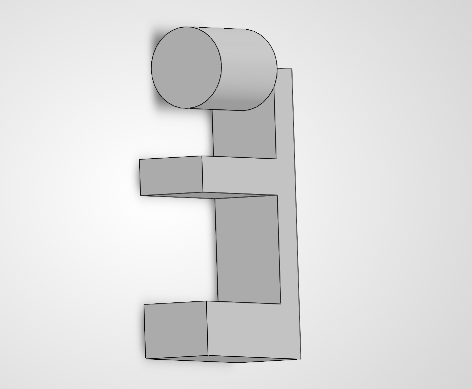
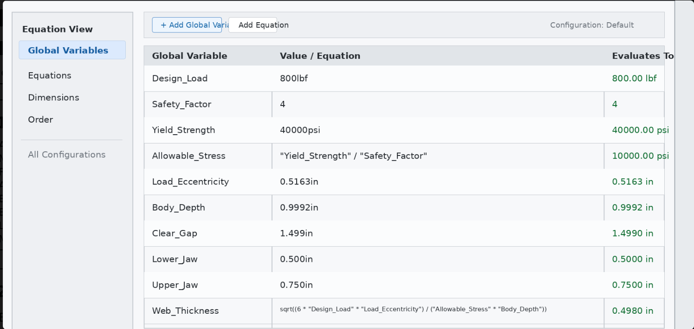

# MEGR 2157 - Parametric Bracket and Link Design

**Student:** Kaleb Dedrick  
**Material:** 6061-T6 Aluminum  
**Design Load:** 800 lbf  
**Safety Factor:** 4  
**Allowable Stress:** 10,000 psi  
**Maximum Deflection:** 0.005 in  

## Objective

The goal of this assignment was to make a parametric CAD model of my bracket and create engineering drawings for the bracket and link. The bracket needs to hold an 800 lbf load and still slide over the T-beam correctly.

## Parametric Bracket Design

I used global variables in SolidWorks to control the main bracket dimensions. This makes the model easier to change later if the load or size needs to change.

Main bracket dimensions:

- Rear web thickness: 0.498 in
- Body depth: 0.9992 in
- Jaw gap: 1.499 in
- Lower jaw thickness: 0.500 in
- Upper jaw thickness: 0.750 in
- Jaw length: 2.000 in
- Pin boss diameter: 1.125 in

The jaw gap is important because the bracket has to slide over the T-beam. The rear web thickness is important because it helps the bracket handle the load.

## Strength Equation Used in CAD

I used the bending stress equation to find the rear web thickness.

**Bending stress equation:**

σ = (6 × F × e) / (b × t²)

Solving for thickness:

t = √[(6 × F × e) / (σ_allow × b)]

Where:

- F = 800 lbf
- e = 0.5163 in
- b = 0.9992 in
- σ_allow = 10,000 psi

Calculation:

t = √[(6 × 800 × 0.5163) / (10,000 × 0.9992)]

t = √(2478.24 / 9992)

t = √(0.2480)

t = 0.498 in

The rear web thickness was set to **0.498 in**. I put this value into the SolidWorks Equation Manager as `WEB_THICKNESS`.

## Stress and Deflection Check

### Stress Check

σ = (6 × F × e) / (b × t²)

σ = [6 × 800 × 0.5163] / [0.9992 × (0.498)²]

σ = 10,000 psi

The stress is equal to the allowable stress, so the bracket meets the stress requirement.

### Deflection Check

δ = (4 × F × e³) / (E × b × t³)

Where E = 10,000,000 psi for 6061-T6 aluminum.

δ = [4 × 800 × (0.5163)³] / [10,000,000 × 0.9992 × (0.498)³]

δ = 0.00036 in

Since 0.00036 in is less than 0.005 in, the bracket meets the deflection requirement.

## Engineering Drawing and Tolerances

The drawing is set up in third-angle projection. It includes front, top, right, and isometric views.

The material is 6061-T6 aluminum with a mill finish.

General tolerances:

- X.X ± 0.02 in
- X.XX ± 0.01 in
- X.XXX ± 0.005 in

The 1.499 in jaw gap is a functional dimension because it has to slide over the T-beam. I used a tighter tolerance on this feature:

1.499 in +0.005 / -0.000

This helps make sure the gap does not become too small during manufacturing.

## Link Design

The link was modeled to connect to the bracket.

Link dimensions:

- Width: 1.500 in
- Thickness: 0.375 in
- Hole center distance: 2.000 in
- Overall length: 3.500 in

The overall link length was found with this equation:

L_link = Hole Center Distance + Outside Width

L_link = 2.000 in + 1.500 in

L_link = 3.500 in

The 0.500 in hole uses an H7/g6 sliding fit. The 1.000 in hole uses an H7/p6 fit.

The drawing datums are:

- Datum A: Flat face of the link
- Datum B: Center of the 1.000 in hole
- Datum C: Center of the 0.500 in hole

## Process Documentation

I started by looking at my bracket dimensions from the previous assignment. I separated the dimensions into strength-related dimensions and fit-related dimensions.

The rear web thickness was controlled by the stress calculation. The jaw gap was controlled by the T-beam fit. Using parameters made it easier to keep the model organized.

One mistake I had was:  
**At first, some of my dimensions were too close together and were hard to read. I moved the dimensions and reorganized the drawing so the views were clearer and easier to understand.**

Actual time spent:  
**6 hours**

## Lessons Learned

I learned that using parameters makes a CAD model easier to change. The rear web thickness is connected to the stress calculation, so I know why that dimension is important.

I also learned that tolerances should depend on the job of the feature. The jaw gap needs a tighter tolerance because it has to slide over the T-beam. Outside edges that do not affect the fit can use looser tolerances. If every dimension had a very tight tolerance, the part would cost more and be harder to make.

## CAD Download Links

- **Bracket CAD file:** [Download the bracket STEP file](Kaleb_Dedrick_MEGR2157_Bracket.step)
- **Link CAD file:** [Download the link STEP file](Kaleb_Dedrick_MEGR2157_Link_Parametric.step)
- **Equation table:** [Download the parametric equation table](Parametric_Equation_Table.csv)
